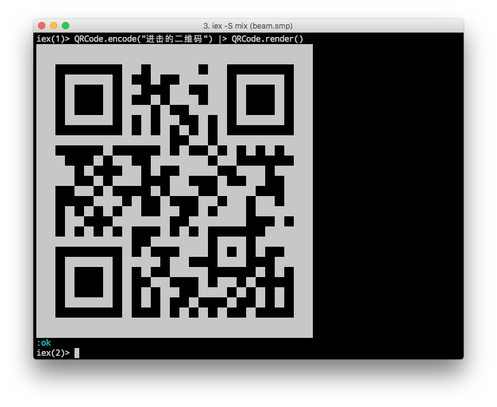

# QRCode

QR Code in Elixir.



Spec:
- Version: 1 - 7
- ECC level: L
- Encoding mode: Byte

References:
- ISO/IEC 18004:2006(E)
- http://www.thonky.com/qr-code-tutorial/

## Usage

```
$ iex -S mix
iex> QRCode.encode("https://www.google.com") |> QRCode.render()
iex> QRCode.encode("你好，世界！")           |> QRCode.render()
iex> QRCode.encode("unicode support 😃")     |> QRCode.render()
```
More [examples](lib/example.ex).

## Draw custom pattern

1. Start with the data you want to encode, along with all 0s pattern.
```
iex> data = QRCode.encode("https://github.com/sunboshan/qrcode", <<0::600>>)
```

2. Choose to render QR Code in normal position or rotate 90 degree clockwise.
```
iex> QRCode.render(data)
iex> QRCode.render2(data)
```
 

3. Draw a custom pattern by changing bits in the second parameter.
```
iex> QRCode.encode("https://github.com/sunboshan/qrcode", <<0b110110101010110101101101101010101101011010110110101010110110100101111101101011010110101011101010110101011010101011011101010101010001010100010101000101010101000101010001010101000001010011010101101110100111010101110111011111110101011101010111010111110101100010101011000101000111000110011001100110011111100111011011000111011001100010101101011110000110010001100100011111100101011001000110010011100101100111101010111100000101010101010101010101010101010101010101010101010101000111010101101111001101010011011101000101000101000101010100010100010100010101000101000101110101010101101010000000000000000000000000::600>>) |> QRCode.render2()
```

